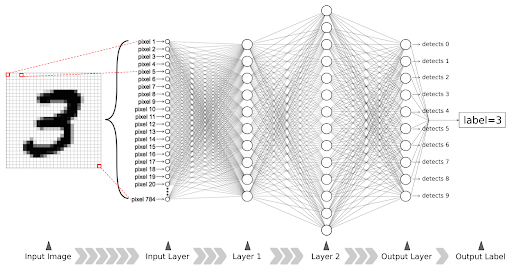
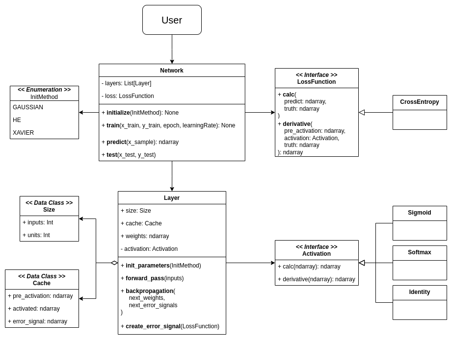

# Deep Neural Network
## Overview

	 
    
    < source: <a href="galliot.us"> galliot.us </a>  >
    

A simple Deep Neural Network that classifies MNIST digit images(28 x 28 pixels) in one-hot encoded form. The implementation is more focused on readability and maintainability for educational purpose rather than performance, following(trying to 😅) principles of object oriented programming. 

## Structure

	

## Possible Improvements

## Background
For theoritical background, please refer to those pdf docs directly exported from my personal Notion. They are largely based on the books [Deep Learning: Foundations and Concepts](https://www.bishopbook.com/) by Hugh Bishop and [Understanding Deep Learning](https://udlbook.github.io/udlbook/) By Simon J.D. Prince.
1. [Classification](docs/01-classification.pdf)
2. [Deep Neural Networks](docs/02-deep-neural-networks.pdf)
3. [Gradient Descent](docs/03-gradient-descent.pdf)
4. [Backpropagation](docs/04-backpropagation.pdf)

## License
MIT
